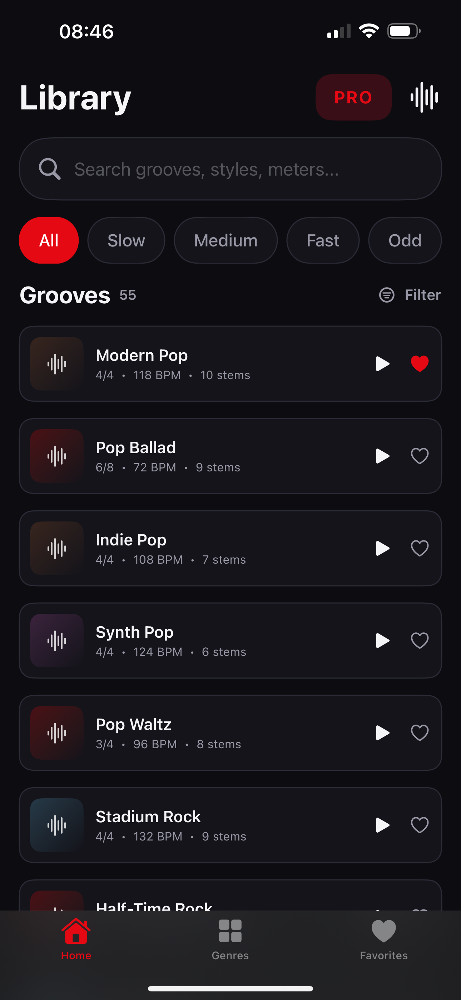
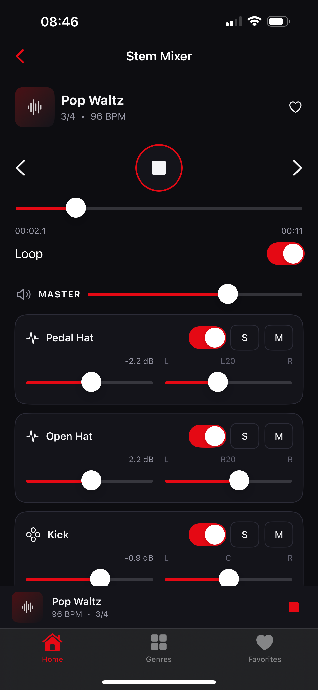
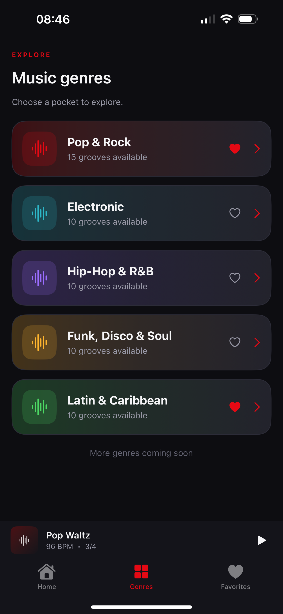
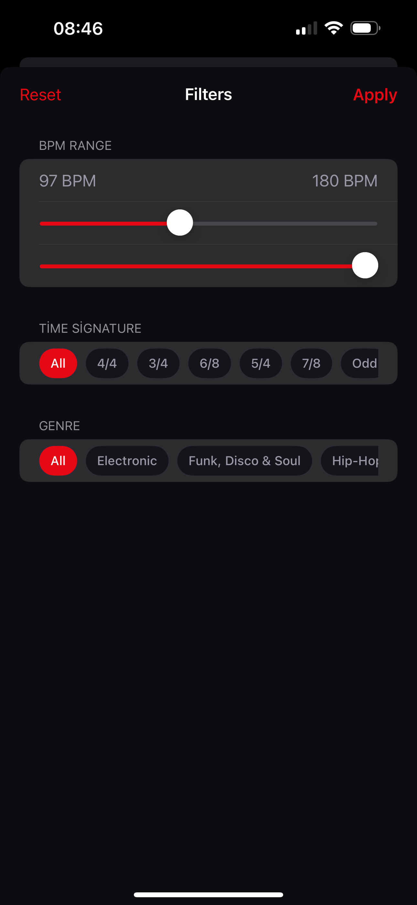

# GrooveMixer for iOS

A native iOS drum-groove practice and multi-stem mixing app.

## About

GrooveMixer is designed for playing, mixing, and practicing with multi-stem drum grooves. The app combines a searchable groove library with per-stem controls and a focused practice workflow.

The production app uses a shared realtime C++17 audio engine behind an Objective-C++ bridge. Its monitoring path intentionally includes a 120 ms delay, making it a delayed practice monitor rather than a zero-latency instrument.

This public repository is a documentation-only showcase. Production source code, private audio assets, signing material, store configuration, and credentials remain private.

## Screenshots

  
  
  
  

## Highlights

- Groove library with search, BPM, and time-signature filters
- Multi-stem mixer with volume, pan, mute, solo, and enable controls
- Looping, groove navigation, mini player, and persistent tab navigation
- Onboarding and PRO subscription paywall
- StoreKit entitlement validation for monthly and yearly subscriptions
- Delayed practice monitoring with AVAudioUnitDelay
- MP3 stem decoding outside the realtime audio callback
- iOS 17+ native application

## Architecture

~~~mermaid
flowchart TD
    V[SwiftUI views] --> APP[App state and navigation]
    APP --> LIB[Groove library and filters]
    APP --> MIX[Stem mixer]
    MIX --> SERVICE[AudioService]
    SERVICE --> SESSION[AVAudioSession]
    SERVICE --> BRIDGE[Objective-C++ audio bridge]
    BRIDGE --> CORE[Shared C++17 realtime audio engine]
    CORE --> STEMS[Decoded stereo PCM stems]
    APP --> STORE[StoreKit entitlement state]
    STORE --> PAYWALL[PRO paywall]
~~~

The SwiftUI layer owns navigation, library state, mixer controls, onboarding, and subscription presentation. AudioService configures the device session, while the bridge connects Swift to the shared engine. The engine performs synchronized multi-stem mixing, looping, mute, solo, volume, and pan processing.

## Technology

| Area | Implementation |
| --- | --- |
| UI | SwiftUI |
| Audio session and monitoring | AVAudioSession, AVAudioUnitDelay |
| Native bridge | Objective-C++ |
| Realtime engine | Shared C++17 audio core |
| Purchases | StoreKit subscription entitlement validation |
| Platform | iOS 17 or later |
| Project | Xcode project with C++ engine tests |

## Repository scope

Only showcase documentation and product screenshots are public here. No production source, stem audio, groove metadata, signing certificates, provisioning profiles, API keys, or App Store Connect credentials are included.
